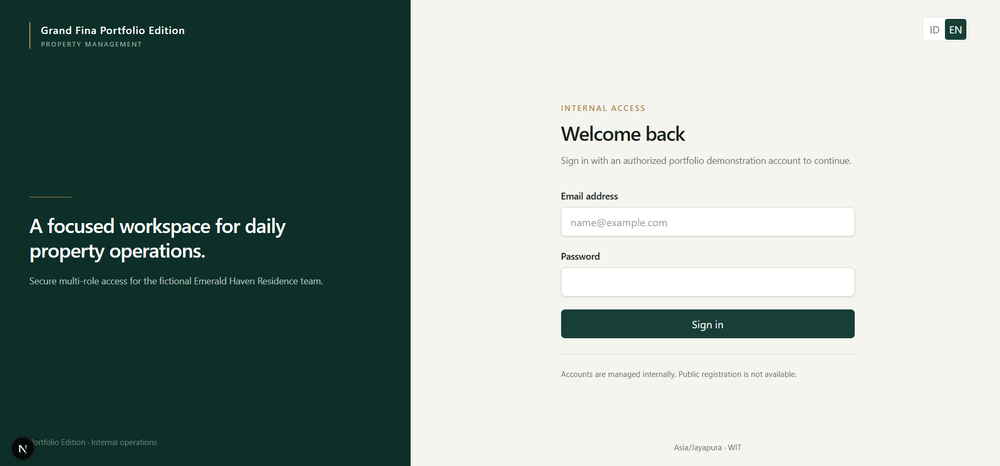
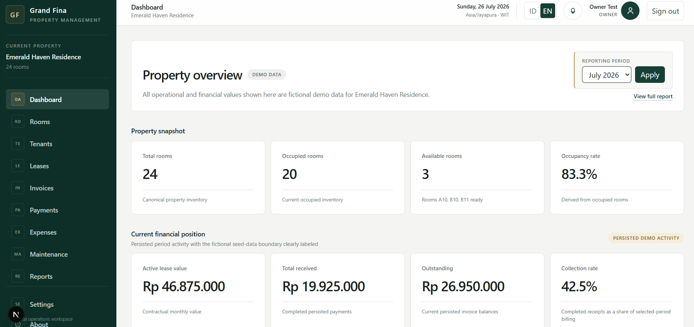
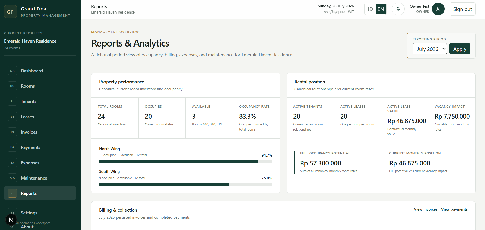
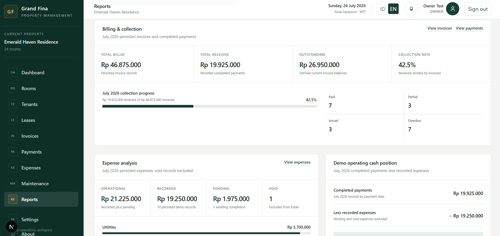
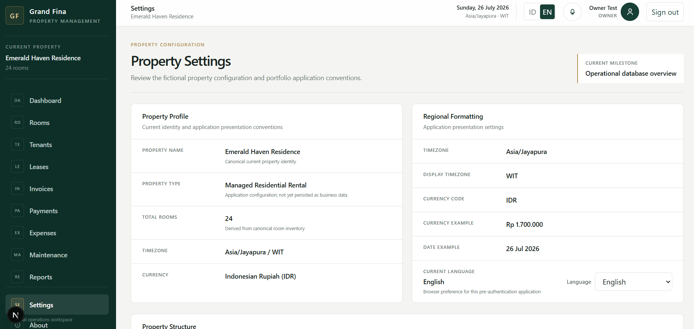
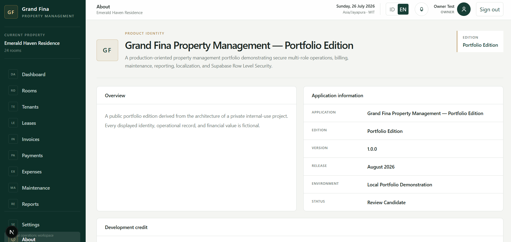
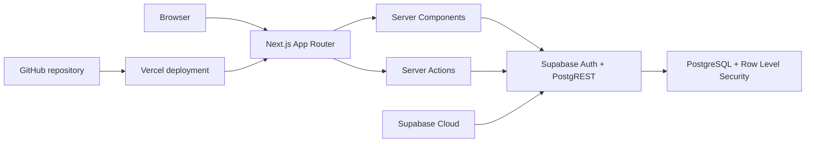

# Grand Fina Property Management

**Portfolio Edition**

A production-oriented, full-stack property management application built with Next.js, TypeScript, Tailwind CSS, Supabase, and PostgreSQL.

[](https://nextjs.org/)
[](https://www.typescriptlang.org/)
[](https://supabase.com/)
[](https://www.postgresql.org/)
[](https://tailwindcss.com/)
[](https://vercel.com/)
[](LICENSE)

> **Live demo:** grand-fina-property-management-port.vercel.app

**[Repository](https://github.com/sigitsyambudi/grand-fina-property-management-portfolio)** · **[Screenshots](#screenshots)** · **[Architecture](docs/architecture.md)** · **[Database](docs/database.md)** · **[Security](docs/security.md)** · **[Case Study](docs/case-study.md)**

## Overview

Grand Fina Property Management brings room inventory, tenant records, rental agreements, billing, collections, expenses, maintenance, and management reporting into one authenticated workspace. It demonstrates how related property operations can be modeled without treating every screen as an isolated CRUD feature.

The public Portfolio Edition uses **Emerald Haven Residence**, an entirely fictional 24-room property. The application is designed for internal operations with Owner, Admin, and Staff roles, Indonesian and English interfaces, and persistence-level authorization through Supabase Row Level Security.

## Why this project matters

This project demonstrates engineering concerns that sit beyond a basic dashboard:

- an authenticated workspace with application-level authorization and database-level RLS;
- property membership boundaries, including authenticated non-member and anonymous isolation;
- domain constraints for room configuration, lease eligibility, billing, payments, expenses, and maintenance;
- Server Components for authenticated reads and Server Actions for validated mutations;
- reporting derived from authoritative operational and financial records;
- bilingual pre-authentication and authenticated experiences;
- responsive, accessible layouts with explicit loading, empty, error, and denied-access states;
- separate fictional public fixtures rather than copied private operational data; and
- a Vercel frontend backed by Supabase Cloud Auth and PostgreSQL.

## Key features

### Property operations

- **Rooms:** canonical inventory, location, floor, status, rate, occupancy, and availability views.
- **Tenants:** property-scoped tenant profiles connected to current room and lease relationships.
- **Leases:** active rental terms with date, room, tenant, rate, and overlap validation.

### Finance

- **Invoices:** monthly billing records, due dates, balances, and payment-derived statuses.
- **Payments:** recorded rent receipts linked to invoices and constrained by invoice balances.
- **Expenses:** categorized operational expenses with auditable lifecycle states.
- **Reports:** occupancy, rental position, collection progress, expenses, maintenance, and cash-position summaries.

### Operations and platform

- **Maintenance:** room-linked issues with category, priority, status, dates, and cost tracking.
- **Settings:** canonical property identity and regional presentation conventions.
- **Authentication:** internally managed Supabase Auth accounts; public sign-up is not part of the application.
- **Authorization:** Owner/Admin writes, Staff read-only access, membership isolation, and RLS enforcement.
- **Localization:** Indonesian and English labels, dates, currency, and domain display values.

## Role-based access model

Authorization is enforced in server operations and again through PostgreSQL RLS. Hiding a button in the browser is not treated as an access-control boundary.

| Persona                  | Read access       | Write access                 | General behavior                                                                                   |
| ------------------------ | ----------------- | ---------------------------- | -------------------------------------------------------------------------------------------------- |
| Owner                    | Assigned property | Permitted operational writes | Can manage rooms and core property records within membership scope.                                |
| Admin                    | Assigned property | Permitted operational writes | Shares the current operational write boundary with Owner.                                          |
| Staff                    | Assigned property | None                         | Can review property-scoped records; mutation attempts are denied.                                  |
| Authenticated non-member | Own profile only  | None                         | Authentication succeeds, but no Emerald Haven Residence membership or operational data is exposed. |
| Anonymous                | None              | None                         | Application-table reads and writes are denied.                                                     |

Demo credentials are intentionally not published in this README.

## Screenshots

All identities, dates, operational records, and financial values visible below are fictional demonstration data.

| Secure internal sign-in                                  | Property operations dashboard                                               |
| -------------------------------------------------------- | --------------------------------------------------------------------------- |
|  |  |

| Management overview                                               | Billing and cash-position detail                                                 |
| ----------------------------------------------------------------- | -------------------------------------------------------------------------------- |
|  |  |

| Property and localization settings                             | Portfolio Edition context                                              |
| -------------------------------------------------------------- | ---------------------------------------------------------------------- |
|  |  |

Additional sanitized captures are available in [`docs/screenshots/`](docs/screenshots/).

## Technical architecture

Grand Fina is a modular monolith in one Next.js App Router application. Server-first data access is kept behind focused auth, data, and Supabase modules, while PostgreSQL remains the authoritative persistence boundary.



The application does not introduce microservices, queues, Redis, a generic repository layer, or global client state without a demonstrated need.

## Database and security

The PostgreSQL model covers profiles, properties, property memberships, rooms, tenants, leases, invoices, payments, expenses, and maintenance records. Operational records are property-scoped, and composite relationships prevent cross-property references.

Security and integrity controls include:

- Supabase Auth for session identity;
- property membership and Owner/Admin/Staff roles for authorization;
- RLS on application tables for membership-scoped reads and role-scoped writes;
- server-side runtime validation before mutations;
- database constraints and transactional functions for domain invariants;
- canonical North Wing/South Wing and Floor 1/Floor 2 room combinations;
- active-lease constraints that protect room and tenant eligibility;
- idempotent invoice-period uniqueness and payment-balance protection;
- auditable status transitions instead of hard deletion for financial records; and
- CSP, framing, referrer, MIME-sniffing, permissions, and production HTTPS headers.

Authorization is therefore enforced at application and persistence boundaries, not only through interface visibility. See the detailed [security model](docs/security.md) and [database guide](docs/database.md).

## Technology stack

| Area                | Technology                                                                           |
| ------------------- | ------------------------------------------------------------------------------------ |
| Framework           | Next.js 16.3.0, App Router                                                           |
| UI runtime          | React 19.2.4                                                                         |
| Language            | TypeScript 5, strict configuration                                                   |
| Styling             | Tailwind CSS 4                                                                       |
| Backend integration | Supabase JavaScript and SSR clients                                                  |
| Database            | PostgreSQL through Supabase                                                          |
| Authentication      | Supabase Auth                                                                        |
| Authorization       | Server-side role checks and PostgreSQL RLS                                           |
| Deployment          | Vercel and Supabase Cloud                                                            |
| Quality             | ESLint 9, TypeScript validation, production build, SQL validation scripts, npm audit |

## Application modules

| Module      | Purpose                                                                                    |
| ----------- | ------------------------------------------------------------------------------------------ |
| Dashboard   | Presents the current property, occupancy, billing, collection, and cash-position snapshot. |
| Rooms       | Manages the canonical 24-room inventory and room configuration.                            |
| Tenants     | Maintains fictional tenant profiles and current rental relationships.                      |
| Leases      | Manages eligible room/tenant assignments and rental terms.                                 |
| Invoices    | Tracks monthly billing periods, due dates, amounts, and balances.                          |
| Payments    | Records invoice-linked receipts and payment status.                                        |
| Expenses    | Tracks categorized property expenditure and lifecycle state.                               |
| Maintenance | Tracks room-linked operational issues, priority, progress, and costs.                      |
| Reports     | Derives occupancy, rental, collection, expense, maintenance, and cash summaries.           |
| Settings    | Documents canonical property and regional presentation settings.                           |
| About       | Explains the product identity, public-edition boundary, and portfolio context.             |

## Fictional portfolio data

> All tenant identities, room configuration, leases, invoices, payments, expenses, maintenance records, and financial metrics in this repository are fictional and exist solely for demonstration and testing.

Emerald Haven Residence contains 24 fictional rooms: A01-A12 in North Wing and B01-B12 in South Wing, distributed across Floor 1 and Floor 2. Checked-in seed data, screenshots, notes, contacts, organizations, vendors, references, and monetary values belong only to this public demonstration dataset.

## Localization

The interface supports Indonesian (`ID`) and English (`EN`) before and after authentication. Typed dictionaries keep application labels aligned, while display helpers localize dates, Indonesian Rupiah values, room locations, statuses, and operational terminology. Locale preference persists in the browser.

Business dates are stored as date-only values where appropriate. Event timestamps are UTC, with application display conventions based on `Asia/Jayapura` (WIT).

## Validation and quality assurance

The portfolio release workflow includes the following verified or repository-backed checks:

- ESLint and strict TypeScript validation;
- optimized Next.js production builds;
- dependency vulnerability review with `npm audit`;
- canonical seed, read-layer, and reporting SQL validation scripts;
- a disposable local authorization matrix covering Owner, Admin, Staff, authenticated non-member, anonymous, and cross-property cases;
- denied writes and invalid domain operations as well as successful access cases;
- a Supabase Cloud validation script for the manual cloud-bootstrap workflow;
- Indonesian/English dictionary parity and localized UI review; and
- responsive visual review using sanitized fictional screenshots.

The repository does not claim a hosted CI pipeline or comprehensive automated browser-test coverage. Database and authorization checks require a disposable Supabase environment.

## Project structure

```text
app/          Next.js routes, layouts, Server Components, and Server Actions
components/   Feature presentation and focused interactive UI boundaries
lib/          Authentication, data operations, validation, localization, and clients
supabase/     Canonical migrations, fictional seeds, SQL tests, and cloud bootstrap aids
docs/         Architecture, security, database, design, testing, and case-study guides
scripts/      Disposable local Auth provisioning and authorization validation
public/       Static assets served by Next.js
```

## Local development

### Prerequisites

- a current Node.js LTS release and npm;
- Docker Desktop or another Docker-compatible runtime; and
- Supabase CLI for the complete local database and authorization workflow.

### Application setup

```bash
git clone https://github.com/sigitsyambudi/grand-fina-property-management-portfolio.git
cd grand-fina-property-management-portfolio
npm install
cp .env.example .env.local
npm run dev
```

Open [http://localhost:3000](http://localhost:3000) for local development. Authentication requires either a running local Supabase stack or a separately configured Supabase project.

### Environment variables

Populate `.env.local` with browser-safe project values:

```dotenv
NEXT_PUBLIC_SUPABASE_URL=https://your-project-ref.supabase.co
NEXT_PUBLIC_SUPABASE_PUBLISHABLE_KEY=sb_publishable_your-key
```

Never commit `.env.local`. Never place a service-role key, database password, or another privileged credential in a `NEXT_PUBLIC_*` variable.

## Supabase development

For a disposable local stack:

```bash
npx supabase start
npx supabase db reset
node scripts/provision-local-auth-users.mjs
node scripts/validate-local-auth.mjs
```

The reset recreates the local development database from `supabase/migrations/`, then loads the fictional seeds. It must not be aimed at a shared or production database. The local Auth guide documents the complete disposable validation workflow without publishing passwords here: [Local Auth Testing](docs/local-auth-testing.md).

`supabase/migrations/` is the canonical schema history. [`supabase/cloud-bootstrap.sql`](supabase/cloud-bootstrap.sql) is a deployment aid for the current one-time, manual Supabase Cloud bootstrap workflow; it is **not** a replacement for migrations. Follow the dedicated [Supabase Cloud deployment guide](docs/supabase-cloud-deployment.md).

## Deployment

The deployed portfolio topology uses:

- **Frontend:** Vercel
- **Authentication and database:** Supabase Cloud

Configure the following client-safe values in the intended Vercel environments:

```text
NEXT_PUBLIC_SUPABASE_URL
NEXT_PUBLIC_SUPABASE_PUBLISHABLE_KEY
```

Apply canonical database migrations—or the documented one-time cloud bootstrap workflow for a fresh project—before provisioning fictional demonstration users. Then validate Owner/Admin success paths and Staff/non-member/anonymous denials against the deployment.

> Never expose Supabase service-role keys or database passwords through `NEXT_PUBLIC_*` environment variables.

The verified Vercel production URL is not stored in this repository. Replace `LIVE_DEMO_URL` near the top of this README before publication.

## Documentation

| Guide                                                                       | Scope                                                                              |
| --------------------------------------------------------------------------- | ---------------------------------------------------------------------------------- |
| [Technical Blueprint](technical-blueprint.md)                               | Domain boundaries, architecture decisions, workflows, and implementation guidance. |
| [Architecture](docs/architecture.md)                                        | Runtime boundaries, request flow, integrity rules, and deliberate non-goals.       |
| [Database](docs/database.md)                                                | Core tables, canonical fictional property, constraints, seeds, and validation.     |
| [Security](docs/security.md)                                                | Authentication, authorization, RLS, sensitive-data rules, and HTTP hardening.      |
| [Case Study](docs/case-study.md)                                            | Problem framing, engineering challenges, solution, and demonstrated outcomes.      |
| [Brand Guidelines](docs/brand-guidelines.md)                                | Public-edition naming, voice, color, and identity usage.                           |
| [Design System](docs/design-system.md)                                      | UI foundations, layout, typography, states, and interaction conventions.           |
| [Local Auth Testing](docs/local-auth-testing.md)                            | Disposable local personas and allowed/denied authorization checks.                 |
| [Supabase Cloud Deployment](docs/supabase-cloud-deployment.md)              | Fresh-project bootstrap, validation, user provisioning, and Vercel configuration.  |
| [Reporting Decision](docs/decisions/0001-management-reporting-semantics.md) | Accounting semantics used by dashboard and management reports.                     |

## Portfolio case study

**Problem.** Property operations connect occupancy, tenants, leases, billing, payments, expenses, and maintenance. Spreadsheet-style workflows can make these relationships difficult to validate and authorize consistently.

**Solution.** Grand Fina organizes those workflows in one server-first application with typed validation, relational constraints, role-aware operations, RLS, localized presentation, and reporting derived from authoritative records.

**Engineering challenges.** The implementation protects room/lease consistency, invoice and payment integrity, property isolation, denied-access behavior, public/private data separation, and bilingual UI parity without introducing unnecessary distributed infrastructure.

**Outcome.** The Portfolio Edition demonstrates a structured web application, explicit security boundaries, a public-safe fictional dataset, and a cloud deployment model suitable for technical portfolio review. It does not claim business results or approval for real-world property operations.

For additional context, read the full [case study](docs/case-study.md).

## Roadmap

- Add a hosted CI workflow for lint, TypeScript, build, and isolated database validation.
- Expand automated browser coverage for critical workflows and permission failures.
- Add deeper operational analytics while retaining documented accounting semantics.
- Explore notification workflows with explicit privacy and delivery boundaries.
- Attach a verified custom domain or production URL to the public portfolio entry.

These items are future improvements, not implemented features.

## License

This project is available under the [MIT License](LICENSE).

## Author

**Sigit Syambudi** · [GitHub](https://github.com/sigitsyambudi)
