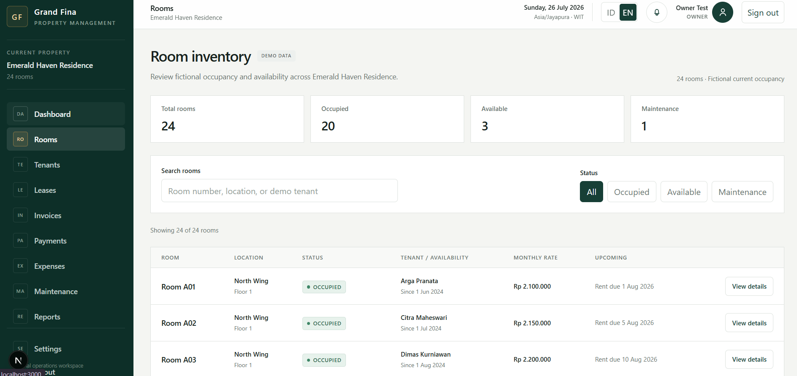
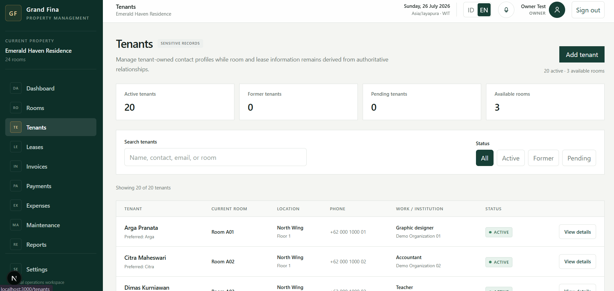

# Grand Fina Property Management — Portfolio Edition

A production-oriented property management portfolio project demonstrating secure multi-role operations, billing, maintenance, reporting, localization, and Supabase Row Level Security.

> All property, tenant, lease, invoice, payment, expense, maintenance, occupancy, and financial data in this repository are entirely fictional. This public edition is derived from the architecture of a private internal-use project; no private operational dataset or history is included.

## Portfolio dataset

The fictional demonstration property is **Emerald Haven Residence**, a managed residential rental with 24 rooms:

- North Wing: A01–A12
- South Wing: B01–B12
- Floor 1 and Floor 2 in each wing
- 20 occupied, 3 available, and 1 maintenance room
- fictional IDR rates and reconciled operational records

The seed uses only fictional people, `example.com` email addresses, demonstration references, vendors, notes, dates, and financial values.

## Engineering scope

- Next.js 16.3.0 App Router, React 19, strict TypeScript, and Tailwind CSS
- Supabase PostgreSQL, Auth, and property-scoped Row Level Security
- owner, administrator, staff, and denied-access validation personas
- server-first reads and role-aware server mutations
- database constraints for tenancy, billing, payment, expense, and maintenance workflows
- English and Indonesian localization
- responsive, accessible operational screens
- cash-based management reporting derived from authoritative records

This repository demonstrates a production-oriented architecture. It makes no claim that this public edition has been deployed or approved for live operations.

## Local setup

Requirements: a current Node.js LTS runtime, npm, Docker, and the Supabase CLI.

```bash
npm install
cp .env.example .env.local
supabase start
supabase db reset --local
npm run dev
```

Use the local Supabase output to populate the public client variables documented in `.env.example`. Never commit local credentials, database passwords, service-role keys, or generated `.env` files.

Optional fictional local test identities are documented in [docs/local-auth-testing.md](docs/local-auth-testing.md).

## Validation

```bash
npm run lint
npx tsc --noEmit
npm run build
psql "$LOCAL_DATABASE_URL" -f supabase/tests/validate_canonical_seed.sql
psql "$LOCAL_DATABASE_URL" -f supabase/tests/validate_read_layer_seed.sql
psql "$LOCAL_DATABASE_URL" -f supabase/tests/validate_reporting.sql
```

Database validation requires a running disposable local Supabase environment. The reset command is destructive only to that local development database.

## Screenshots

Private-derived and stale screenshots were intentionally removed during portfolio sanitization. New screenshots should be captured only from a running local instance loaded with the fictional portfolio dataset.

| Secure login                                           | Operations dashboard                                    |
| ------------------------------------------------------ | ------------------------------------------------------- |
|  |  |

| Room management                                           | Tenant management                                             |
| --------------------------------------------------------- | ------------------------------------------------------------- |
|  |  |

| Financial reporting                                                       | Management reports                                  |
| ------------------------------------------------------------------------- | --------------------------------------------------- |
|  |  |

## Documentation

- [Architecture](docs/architecture.md)
- [Database](docs/database.md)
- [Security](docs/security.md)
- [Case study](docs/case-study.md)
- [Brand guidelines](docs/brand-guidelines.md)
- [Design system](docs/design-system.md)
- [Technical blueprint](technical-blueprint.md)

## Author and license

Lead developer: Sigit Syambudi. See [LICENSE](LICENSE) for licensing terms.
